<p align="center">
  
</p>

<h1 align="center">SheetForge</h1>

<p align="center">
  <strong>A feature-rich spreadsheet application built with Next.js 16, React 19, and shadcn/ui</strong>
</p>

<p align="center">
  <em>Stanford University · AI-Assisted Development Course · Assignment 2: "The Clone — Build a Spreadsheet"</em>
</p>

<p align="center">
  <a href="#features">Features</a> •
  <a href="#screenshots">Screenshots</a> •
  <a href="#quick-start">Quick Start</a> •
  <a href="#architecture">Architecture</a> •
  <a href="#project-structure">Project Structure</a> •
  <a href="#testing">Testing</a> •
  <a href="#ai-assisted-development">AI-Assisted Development</a> •
  <a href="#documentation">Documentation</a>
</p>

---

## About the Project

**SheetForge** is a fully-featured spreadsheet application built as part of a Stanford University AI-assisted development course. The assignment objective is to clone the core functionality of a spreadsheet (like Google Sheets or Excel) using AI as a coding partner — exploring how strategic prompting, iterative development, and human–AI collaboration shape the final product.

This project achieves — and significantly exceeds — the **High Ceiling** scope tier:

| Tier | Status | Description |
|------|--------|-------------|
| Minimum Viable | ✅ Complete | Editable grid with cell navigation and text entry |
| Stretch Goals | ✅ Complete | Working formulas (`SUM`, `AVERAGE`), column/row resizing, cell formatting (bold, color) |
| **High Ceiling** | ✅ **Complete** | Formula bar, multi-sheet tabs, cell references across sheets, CSV import/export, find & replace, dark mode, undo/redo history |
| **Beyond Assignment** | ✅ **Complete** | Insert/delete rows & columns, sorting, drag-fill, cell merge, auto-filter, advanced formulas (IF, VLOOKUP, COUNTIF, SUMIF), data validation, cell comments, named ranges, inline mini charts, onboarding tour, print/PDF export |

> **Development approach:** Built with the assistance of **20 specialized AI agents** covering the full product lifecycle — from Product Manager and UX Designer to Frontend Developer and QA Engineer. The agent ecosystem is maintained separately and is not included in this repository.

---

## Features

| Category | Capabilities |
|----------|-------------|
| **Grid Engine** | 26-column × dynamic-row grid, cell selection, range selection, keyboard navigation, insert/delete rows & columns |
| **Formula Engine** | Recursive-descent parser, 20+ functions (`SUM`, `AVERAGE`, `IF`, `VLOOKUP`, `COUNTIF`, `SUMIF`, `AND`, `OR`, `NOT`, `CONCATENATE`, `LEFT`, `RIGHT`, `LEN`, `ROUND`, `TRIM`, etc.), cell references, dependency DAG with circular reference detection |
| **Formatting** | Bold, italic, text color, background color, text alignment, number/currency/percentage/date formats |
| **Data Operations** | CSV import/export, clipboard copy/paste, find & replace with regex support, column sorting (A→Z / Z→A), drag-fill with pattern detection |
| **Multi-Sheet** | Tab-based sheet management, add/rename/delete sheets, cross-sheet references (`=Sheet2!A1`) |
| **Cell Merge** | Merge/unmerge cell ranges, toolbar toggle |
| **Data Filtering** | Auto-filter dropdowns per column, value checkboxes, text search within filter |
| **Data Validation** | List, number, text-length validation rules; dropdown select for list-validated cells |
| **Cell Comments** | Add/edit/delete comments with timestamps, orange triangle indicator |
| **Named Ranges** | Define named ranges, use in formulas (`=SUM(Revenue)`), Named Range Manager dialog, autocomplete |
| **Inline Charts** | `=BARCHART(range)` and `=PIECHART(range)` render SVG mini charts directly in cells |
| **Conditional Formatting** | Rule-based cell styling (e.g., "if value > 100, color red") |
| **Undo/Redo** | Command-pattern undo stack with 50-level history |
| **Persistence** | Auto-save to localStorage with debounced writes |
| **Theming** | Light & dark mode with system preference detection |
| **Onboarding** | 8-step interactive welcome tour with spotlight highlights |
| **Context Menu** | Right-click for insert/delete rows & columns, sort, add comment |
| **Print/PDF** | Print stylesheet with forced light mode, hidden chrome, gridlines |
| **Accessibility** | ARIA attributes, keyboard-only navigation, screen reader support |

---

## Screenshots

### Formulas & Data — Light Mode

> Cell B5 selected showing `=SUM(B2:B4)` in the formula bar, with computed totals across Revenue, Cost, and Profit columns.


### Formulas & Data — Dark Mode

> Same dataset rendered in dark mode, demonstrating the full theming system with `next-themes`.


---

## Quick Start

```bash
# Install dependencies
npm install

# Start development server
npm run dev

# Open in browser
open http://localhost:3000
```

---

## Tech Stack

```mermaid
graph TB
    subgraph Frontend["🖥️ Frontend"]
        Next["Next.js 16<br/>App Router + RSC"]
        React["React 19"]
        TS["TypeScript 5"]
    end
    
    subgraph UI["🎨 UI Layer"]
        Shadcn["shadcn/ui<br/>new-york style"]
        Tailwind["Tailwind CSS v4"]
        Lucide["Lucide React Icons"]
        Themes["next-themes<br/>Dark Mode"]
    end
    
    subgraph State["📦 State Management"]
        Reducer["useReducer +<br/>Context API"]
        Formula["Formula Engine<br/>Recursive Descent"]
        DAG["Dependency DAG<br/>Cycle Detection"]
    end
    
    subgraph Persist["💾 Persistence"]
        LS["localStorage<br/>Auto-save"]
        CSV["CSV Import/Export"]
    end
    
    subgraph Testing["🧪 Testing"]
        Vitest["Vitest<br/>Unit Tests"]
        Playwright["Playwright<br/>E2E Tests"]
    end
    
    Next --> React --> Shadcn
    Shadcn --> Tailwind
    React --> Reducer
    Reducer --> Formula --> DAG
    Reducer --> LS
    LS --> CSV
    Next -.-> Vitest
    Next -.-> Playwright
```



---

## Architecture


---

## Data Flow


---

## Project Structure

```
sheetforge/
├── app/                              # Next.js App Router
│   ├── layout.tsx                    # Root layout with ThemeProvider
│   ├── page.tsx                      # Main spreadsheet page
│   ├── globals.css                   # Global styles + CSS variables
│   └── spreadsheet.css               # Spreadsheet-specific styles
│
├── components/
│   ├── spreadsheet/                  # Feature components (11 files)
│   │   ├── Grid.tsx                  # Core grid engine (selection, editing, rendering)
│   │   ├── Toolbar.tsx               # Formatting toolbar + actions
│   │   ├── SheetTabs.tsx             # Multi-sheet tab bar
│   │   ├── StatusBar.tsx             # Selection aggregation (SUM, AVG, COUNT)
│   │   ├── FindReplaceDialog.tsx     # Find & replace dialog
│   │   ├── OnboardingTour.tsx        # Interactive welcome tour (8 steps)
│   │   ├── ColorPicker.tsx           # Color selection for font/background
│   │   ├── ConditionalFormatDialog.tsx # Conditional formatting rule builder
│   │   ├── FormulaAutocomplete.tsx   # Formula suggestion dropdown
│   │   ├── GridContextMenu.tsx       # Right-click context menu
│   │   └── NamedRangeDialog.tsx      # Named range manager dialog
│   ├── ui/                           # shadcn/ui primitives (19 components)
│   └── theme-provider.tsx            # Dark mode provider
│
├── lib/
│   ├── formula-engine.ts             # Recursive-descent formula parser + evaluator
│   └── utils.ts                      # cn() helper + utilities
│
├── state/
│   └── spreadsheet-context.tsx       # Global state (useReducer + Context)
│
├── types/
│   └── spreadsheet.ts                # TypeScript interfaces & enums
│
├── __tests__/
│   ├── unit/                         # Vitest unit tests (11 files)
│   │   ├── formula-engine.test.ts
│   │   ├── formula-engine-edge.test.ts
│   │   ├── formula-engine-comprehensive.test.ts
│   │   ├── formula-engine-stage5.test.ts
│   │   ├── helpers.test.ts
│   │   ├── helpers-edge.test.ts
│   │   ├── helpers-comprehensive.test.ts
│   │   ├── reducer.test.ts
│   │   ├── reducer-edge.test.ts
│   │   ├── reducer-comprehensive.test.ts
│   │   └── reducer-stage4-6.test.ts
│   ├── e2e/                          # Playwright E2E tests (4 files)
│   │   ├── features.spec.ts
│   │   ├── grid-selection.spec.ts
│   │   ├── edge-cases.spec.ts
│   │   └── comprehensive.spec.ts
│   └── setup.ts
│
├── docs/                             # 📚 Documentation
│   ├── product/                      # Product documentation
│   │   ├── PRD.md                    # Product Requirements Document (v2.1.0)
│   │   ├── ARCHITECTURE_REVIEW.md    # Technical architecture analysis
│   │   ├── QA_REVIEW.md              # Test plan audit & recommendations
│   │   ├── ASSIGNMENT.md             # Stanford assignment brief
│   │   └── visual_design_spec.md     # Visual design specification (Stages 4–6)
│   └── testing.md                    # Auto-test documentation & conventions
│
├── public/                           # Static assets
└── [config files]                    # Next.js, TypeScript, ESLint, Vitest, Playwright
```

---

## Testing

```bash
# Run unit tests
npm run test

# Run unit tests in watch mode
npm run test:watch

# Run unit tests with coverage
npm run test:coverage

# Run E2E tests (requires dev server running)
npm run test:e2e

# Run all tests (unit + E2E)
npm run test:all

# Lint
npm run lint
```

### Test Coverage

| Suite | File | Tests | Coverage Area |
|-------|------|:-----:|---------------|
| **Formula Engine** | `formula-engine.test.ts` | 45+ | Core formula parsing, evaluation, error handling, cell refs |
| | `formula-engine-edge.test.ts` | 30+ | Nesting, floats, chaining, whitespace, error propagation |
| | `formula-engine-comprehensive.test.ts` | 60+ | Full coverage: all functions, operators, edge cases |
| | `formula-engine-stage5.test.ts` | 40+ | IF, VLOOKUP, COUNTIF, SUMIF, AND, OR, NOT, text functions |
| **Helpers** | `helpers.test.ts` | 40+ | Cell formatting, coordinate conversion, selection utils |
| | `helpers-edge.test.ts` | 25+ | Boundary values, falsy values, large coordinates |
| | `helpers-comprehensive.test.ts` | 50+ | Extended utility function coverage |
| **Reducer** | `reducer.test.ts` | 180+ | Core state transitions, undo/redo, multi-sheet operations |
| | `reducer-edge.test.ts` | 50+ | Edge cases: paste at boundary, absolute refs, find/replace |
| | `reducer-comprehensive.test.ts` | 80+ | Extended reducer action coverage |
| | `reducer-stage4-6.test.ts` | 60+ | Insert/delete, sort, fill, merge, filter, validation, comments |
| **E2E** | `features.spec.ts` | 12+ | Sheet tabs, find/replace, formatting, toolbar, status bar |
| | `grid-selection.spec.ts` | 15+ | Cell selection, editing, navigation, formulas |
| | `edge-cases.spec.ts` | 10+ | Copy/paste, bulk delete, undo/redo, long text, errors |
| | `comprehensive.spec.ts` | 20+ | Full feature E2E across all stages |

> For complete test documentation, conventions, and the test coverage map, see [docs/testing.md](docs/testing.md).

---

## AI-Assisted Development

SheetForge was developed using a team of **19 specialized AI agents** covering roles across the full product lifecycle — from product strategy and UX research through architecture, development, QA, and technical writing. Each agent contributed to the specific artifacts and decisions documented in this repository.

---

## Documentation

| Document | Location | Description |
|----------|----------|-------------|
| **Product Requirements** | [docs/product/PRD.md](docs/product/PRD.md) | Full PRD v2.1.0 with user stories, acceptance criteria, data model & 7 stages |
| **Architecture Review** | [docs/product/ARCHITECTURE_REVIEW.md](docs/product/ARCHITECTURE_REVIEW.md) | Pre-build technical architecture analysis |
| **QA Review** | [docs/product/QA_REVIEW.md](docs/product/QA_REVIEW.md) | Test plan audit & recommendations |
| **Visual Design Spec** | [docs/product/visual_design_spec.md](docs/product/visual_design_spec.md) | UI design specifications for Stages 4–6 |
| **Assignment Brief** | [docs/product/ASSIGNMENT.md](docs/product/ASSIGNMENT.md) | Stanford course assignment description |
| **Test Documentation** | [docs/testing.md](docs/testing.md) | Test suite documentation & conventions |
| **Developer Rules** | [CLAUDE.md](CLAUDE.md) | Coding conventions & project rules |
| **Contributing** | [CONTRIBUTING.md](CONTRIBUTING.md) | Setup, development workflow & PR guidelines |

---

## Scripts

| Command | Description |
|---------|-------------|
| `npm run dev` | Start development server (port 3000) |
| `npm run build` | Production build |
| `npm run start` | Start production server |
| `npm run lint` | Run ESLint |
| `npm run test` | Run Vitest unit tests |
| `npm run test:watch` | Run unit tests in watch mode |
| `npm run test:coverage` | Run unit tests with coverage report |
| `npm run test:e2e` | Run Playwright E2E tests |
| `npm run test:all` | Run all tests (unit + E2E) |

---

## License

See [LICENSE](LICENSE) for details.
