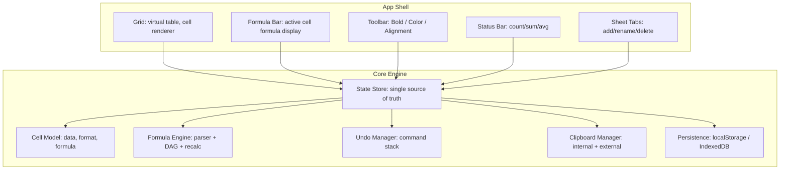

# Architecture Review — SheetForge PRD v1.2.0

> **⚠️ Historical Document:** This review was conducted pre-build against PRD v1.2.0 (2026-02-11). All critical and high-severity items identified below have since been resolved in PRD v2.1.0 and the implemented codebase. This document is preserved as an architecture decision record.

## Document Control

| Field | Value |
|-------|-------|
| **Reviewers** | System Analyst · Technical Architect |
| **PRD Version Reviewed** | 1.2.0 (current PRD: v2.1.0) |
| **Date** | 2026-02-11 |
| **Status** | ✅ Resolved — All items addressed in PRD v2.1.0 and codebase |

---

## Resolution Summary

All 11 critical action items from this review have been addressed:

| Item | Original Severity | Resolution |
|------|:-----------------:|------------|
| SA-01 Data Model Undefined | 🔴 Critical | ✅ Defined in PRD §4.4 — Cell, Sheet, Workbook, MergedRegion, SortState, FilterState, etc. |
| SA-02 Formula Engine Design | 🔴 Critical | ✅ Recursive-descent parser implemented in `lib/formula-engine.ts` with DAG + cycle detection |
| SA-03 Undo/Redo Architecture | 🟡 High | ✅ Command pattern with 50-level stack in `state/spreadsheet-context.tsx` |
| SA-04 State Management | 🟡 High | ✅ `useReducer` + `Context API` — documented in PRD §4.3 |
| TA-01 Grid Rendering | 🔴 Critical | ✅ DOM-based table rendering (26×100 grid) — ADR in PRD §4.3 |
| TA-02 Clipboard | 🟡 High | ✅ `navigator.clipboard` with `text/plain` + `text/html` formats |
| TA-03 localStorage | 🟡 High | ✅ Debounced auto-save to localStorage (500ms) |
| TA-04 Formula Syntax | 🟡 High | ✅ Case-insensitive, 20+ functions, `=Sheet2!A1` cross-sheet refs |
| TA-05 Performance | 🟡 Medium | ✅ DOM grid with optimized re-render; meets <100ms keystroke target |
| TA-06 Accessibility | 🟡 Medium | ✅ ARIA attributes, keyboard navigation, screen reader labels |
| TA-07 Security | 🟡 Medium | ✅ No `eval()`, formula whitelist, XSS sanitization |

---

## Executive Summary

The PRD is product-complete — strong on *what* to build and *why*. However, it is **architecturally silent** on *how* to build it. This gap is normal at the PRD stage, but **must be closed before the first line of code** to avoid cascading refactors during Stage 1 and Stage 2. Below we list every technical concern, grouped by reviewer, with severity and recommended resolution.

---

## Part I — System Analyst Review

> **Lens:** IEEE 29148, Data Flows, State Management, Integration Points

### SA-01 · Data Model Is Undefined 🔴 Critical

The PRD specifies cell text, formulas, formatting (bold, color), multi-sheet tabs, and auto-save — but provides **no data model**. Without a canonical schema, every feature will invent its own shape.

**What's missing:**
- Cell data structure (value, formula, displayValue, format, dataType, metadata)
- Sheet data structure (id, name, cells map, column widths, row heights, conditional formatting rules)
- Workbook root (sheets array, activeSheet, undo stack, settings)

**Risk:** If the cell model isn't extensible from day one, adding formatting, formulas, and conditional formatting later will require expensive migrations of the in-memory and localStorage structures.

**Recommendation:** Define the canonical data model before MVP begins. Design it with all Stage 2 fields present (nullable/optional) so the schema never needs breaking changes.

---

### SA-02 · Formula Engine Architecture Is Unspecified 🔴 Critical

The PRD lists 5 formulas (SUM, AVERAGE, MIN, MAX, COUNT), a formula bar, cross-sheet references, sparklines, and circular detection — but says nothing about how the engine works.

**Decisions needed before build:**

| # | Decision | Options | Impact |
|---|----------|---------|--------|
| 1 | Parser strategy | Regex per-function vs. recursive-descent parser vs. PEG grammar | Regex breaks by Stage 1 when nesting formulas |
| 2 | Dependency graph | None (brute recalc) vs. explicit DAG | Without a DAG, circular detection (CC-201) is impossible |
| 3 | Recalculation trigger | Dirty-flag + topological sort vs. recalc-all-on-every-edit | Recalc-all fails the 200ms budget at 1,000 formula cells |
| 4 | Error propagation | Stop at first error vs. per-cell independent | Determines whether `#ERROR!` in one cell kills downstream formulas |

**Recommendation:** Use a **recursive-descent parser** + **explicit dependency DAG** from day one. This makes circular detection trivial (cycle in the graph), topological-sort recalculation efficient, and formula nesting natural.

---

### SA-03 · Undo/Redo Architecture 🟡 High

The PRD requires "≥20 operation undo stack" (FR-106) and tests for format undo (TC-111). But:

- **What is an "operation"?** A single character typed? A cell value commit? A formatting change? A paste of 50 cells?
- **Granularity determines UX.** Google Sheets batches rapid keystrokes into one undo frame; Excel undoes per-action.
- **Multi-concern undo:** An edit to a cell with a formula triggers recalculation of dependent cells. Does undo revert only the input cell, or also the cascading display changes?

**Recommendation:** Define a **Command pattern** with discrete undo frames. Each user-initiated action (commit cell, apply format, paste, resize) = one frame. Recalculated cells are *not* separate frames — they're automatic consequences.

---

### SA-04 · State Management Strategy Not Addressed 🟡 High

The PRD describes multiple pieces of state: selected cell, editing mode, cell data, formatting, sheet tabs, undo stack, scroll position, auto-save timer. But there's no discussion of:

- **Single store vs. distributed state?** A centralized store (like a Redux-style pattern) vs. ad-hoc component state will significantly affect debuggability and undo/redo.
- **Derived state:** Status bar aggregates, formula display values, and conditional formatting colors are all *derived* from cell data. If not structured as computed properties, they'll get out of sync.

**Recommendation:** Use a **single immutable state tree** for all spreadsheet data (workbook → sheets → cells). Derive display values, aggregates, and conditional formatting via pure functions. This makes auto-save trivial (serialize the root) and undo simple (snapshot or reverse-diff the tree).

---

### SA-05 · Auto-Save Serialization Strategy 🟡 Medium

FR-112 requires localStorage persistence. But:

- **Serialization format?** JSON of the entire workbook? Differential patches?
- **localStorage has a 5MB limit** (CC-111). The PRD acknowledges this but doesn't specify mitigation. A 26×100 grid with formulas, formatting objects, and undo stack could easily approach this.
- **Save frequency:** "Within 5s" — debounced timer? On-change? What about rapid edits?

**Recommendation:**
1. Serialize only cell data (not derived values) — reduce size ~40%.
2. Use `JSON.stringify` with a debounced 2-second timer after last edit.
3. Implement a size check before write; if >4MB, warn and offer to clear undo history first.
4. Consider `IndexedDB` as a fallback for larger datasets (Stage 2).

---

### SA-06 · Copy/Paste Data Flows Are Complex 🟡 Medium

FR-107 and CC-107 describe internal copy/paste and external paste (from Excel/Google Sheets). These are **two completely different code paths:**

| Source | Clipboard Format | Parsing Required |
|--------|-----------------|-----------------|
| Internal (Ctrl+C within app) | App's own cell objects | None — direct object copy |
| External (Excel/Google Sheets) | `text/plain` (tab-delimited) + `text/html` (styled table) | Parse TSV, optionally parse HTML for formatting |

**What's missing:**
- How to detect internal vs. external paste
- Whether external paste preserves formatting or only values
- Cut vs. Copy semantics (cut should clear source cells)

**Recommendation:** Use the Clipboard API. On internal copy, also write a custom MIME type (`application/x-sheetforge`) alongside `text/plain`. On paste, check for custom type first (internal), fall back to `text/plain` parsing (external).

---

### SA-07 · Cross-Sheet Reference Resolution 🟡 Medium

FR-203 requires `=Sheet2!A1` syntax. This creates a new class of complexity:

- **Namespace resolution:** The formula parser must handle sheet-qualified addresses.
- **Dependency graph goes cross-sheet:** The DAG must span all sheets, not just the active one.
- **Sheet deletion/rename cascades:** CC-202 and CC-203 require updating or invalidating references across sheets.

**Recommendation:** Design the cell address as a composite key `{sheetId, col, row}` from the start. Even in MVP, the internal address should carry a sheetId (defaulting to active sheet). This makes cross-sheet references a natural extension, not a rewrite.

---

## Part II — Technical Architect Review

> **Lens:** arc42, C4, Technology Decisions, Performance, Infrastructure

### TA-01 · No Architecture Decision Records (ADRs) 🔴 Critical

Open Question #1 in the PRD asks: *"Should the grid use HTML `<table>` or CSS Grid / Canvas?"* — this is the most consequential technical decision in the project, yet it's unresolved.

**ADR needed immediately:**

| Option | Pros | Cons | Verdict |
|--------|------|------|---------|
| **HTML `<table>`** | Semantic, accessible (free ARIA), cell selection via DOM events, copy/paste "just works" | Slow at 2,600+ cells (26×100), resizing is CSS-complex, virtual scrolling is hard | **Recommended for this project** |
| **CSS Grid** | Flexible layout, responsive, modern CSS | Same DOM node count problem, no built-in cell semantics, worse a11y | Not recommended |
| **Canvas** | Fastest rendering (GPU), virtual scrolling trivial, handles 100k cells | No DOM = no ARIA, no native copy/paste, no native text input, must build everything | Overkill for 26×100 |

**Recommendation:** Use **HTML `<table>`** with **virtual row rendering** (only render visible rows + buffer). For 26 columns × 100 rows, a table performs well enough. Virtual scrolling (render ~40 rows at a time, swap on scroll) handles future scaling. This preserves accessibility (ARIA grid roles), native clipboard, and DOM event model — all of which the PRD requires.

---

### TA-02 · Component Architecture Not Defined 🔴 Critical

The PRD describes 30+ distinct behaviors (grid, formula bar, toolbar, status bar, sheet tabs, context menus, autocomplete dropdown, color picker, etc.) but has no component breakdown.

**Proposed C4 Component Diagram (Level 3):**



**Recommendation:** This separation ensures UI components are dumb renderers and the Core Engine is framework-agnostic, testable in isolation, and reusable if the rendering layer changes.

---

### TA-03 · Technology Stack Not Decided 🔴 Critical

**Open Question #1** in the PRD is still "Open." The PRD says "Firebase Studio (Web)" as the platform, but doesn't specify:

| Decision | Options | Recommendation |
|----------|---------|---------------|
| Framework | Vanilla JS / React / Vue / Svelte | **Vanilla JS + Web Components** (or React if Firebase Studio defaults to Next.js) — minimize dependencies for a 5-hour build |
| State management | None / Redux / Zustand / vanilla store | **Vanilla event-driven store** — custom EventEmitter + immutable snapshots |
| CSS approach | Plain CSS / CSS Modules / Tailwind | **Plain CSS** — the grid has unique layout needs; utility classes add no value |
| Build tool | Vite / Webpack / none | Whatever Firebase Studio provides — likely **Vite** |
| Testing | Jest / Vitest / manual | **Vitest** for formula unit tests; manual for UI |

**Action:** Resolve before MVP. The framework choice affects every file in the project.

---

### TA-04 · Performance Budget Lacks Implementation Strategy 🟡 High

The PRD defines targets (cell edit <50ms, formula recalc <200ms for 1000 cells, scroll ≥30 FPS) but doesn't explain how to **achieve** them.

**Analysis:**

| Target | Threat | Mitigation |
|--------|--------|------------|
| Cell edit <50ms | If every keystroke triggers formula recalc + localStorage save | Debounce recalc to cell commit (Enter/Tab/blur), not per-keystroke |
| Formula recalc <200ms / 1000 cells | Brute-force recalc-all | Topological sort on dependency DAG; only recalc dirty subgraph |
| Scroll ≥30 FPS | Rendering 2,600 DOM nodes (26×100) | Virtual row rendering (render only visible rows + 10-row buffer) |
| Initial load <2s | Large JS bundle + localStorage deserialization | Code-split formula engine; lazy-load Stage 2 features |

**Recommendation:** Bake these mitigations into the architecture. A performance budget is useless without the engineering patterns to meet it.

---

### TA-05 · Conditional Formatting Engine Design 🟡 Medium

FR-204 says "if value > 100, color red." But the PRD doesn't specify:

- **Rule format:** How are rules stored? `{ condition: '>100', style: { bg: 'red' } }`?
- **Rule scope:** Per-cell, per-range, per-column, per-sheet?
- **Evaluation order:** CC-208 says "last rule wins" — this implies ordered array of rules.
- **Performance:** Rules must be re-evaluated on every cell change. If 50 rules × 2,600 cells = 130,000 evaluations per edit — needs optimization.

**Recommendation:** Store rules as an ordered array on the sheet. Evaluate lazily (only cells in the visible viewport + cells that changed). Use a simple expression evaluator (not the full formula parser — conditional formatting doesn't support `=SUM()`).

---

### TA-06 · Sparkline Implementation Approach 🟡 Medium

US-212 requires `=SPARKLINE(A1:A10)` to render a mini chart **inline in a cell**. This is a rendering challenge:

- Sparklines cannot be text — they're **SVG or Canvas graphics** inside a table cell.
- The cell renderer must support two modes: text/number rendering vs. graphic rendering.
- Sparklines depend on data ranges and must **re-render when source data changes** (integrated with the DAG).

**Recommendation:** Implement sparklines as an inline `<svg>` element. The formula engine returns a special `SparklineValue` type (not a number or string). The cell renderer checks the value type and delegates to a sparkline renderer. Keep this as a truly Stage 2 feature — the cell renderer abstraction should be planned now but not built until needed.

---

### TA-07 · Security Considerations Missing 🟡 Medium

While this is a client-only assignment, the PRD includes:
- **CSV import** (FR-205) — a file is read from the user's filesystem
- **Formula evaluation** — user-entered expressions are parsed and executed
- **Paste from external sources** — arbitrary HTML/text enters the app

**Risks:**
- **Formula injection:** `=IMPORTRANGE(...)` or JavaScript injection via formula parser? The parser must be a **closed system** — only whitelist known function names.
- **CSV injection:** CSV cells starting with `=`, `+`, `-`, `@` could be dangerous if the app auto-evaluates them on import.
- **XSS via paste:** If external HTML paste is rendered as HTML (not text), it could inject scripts.

**Recommendation:**
1. Formula parser: whitelist functions; reject anything unknown.
2. CSV import: treat all imported values as **text literals**, not formulas, unless they start with `=`.
3. Paste: always sanitize HTML; prefer `text/plain` parsing.

---

### TA-08 · Event System / Keyboard Shortcut Architecture 🟡 Medium

The PRD specifies extensive keyboard interactions: Arrow, Tab, Enter, Escape, Ctrl+Z/Y, Ctrl+C/V, Ctrl+F, Ctrl+B (bold). But:

- **No keyboard shortcut registry.** Without a centralized handler, shortcuts will conflict. Example: Ctrl+C in edit mode should copy text, but outside edit mode should copy the cell.
- **Modal state matters:** The grid has at least 3 modes — *viewing*, *editing* (cell focused), *selecting* (range drag). Each mode handles the same keys differently.

**Recommendation:** Implement a **keyboard mode state machine:**

```
┌──────────┐   click/Enter    ┌──────────┐   Escape/Enter/Tab   ┌──────────┐
│  VIEWING │ ───────────────▶ │ EDITING  │ ────────────────────▶ │  VIEWING │
│          │                  │          │                       │          │
│          │   click+drag     │          │                       │          │
│          │ ───────────┐     └──────────┘                       │          │
│          │            ▼                                        │          │
│          │     ┌──────────┐   mouse up                        │          │
│          │     │SELECTING │ ──────────────────────────────────▶│          │
│          │     └──────────┘                                    │          │
└──────────┘                                                    └──────────┘
```

Each state has its own keyboard handler map. A central dispatcher routes events to the active state's handler.

---

## Part III — Cross-Cutting Concerns (Joint SA + TA)

### X-01 · No Traceability from PRD to Architecture 🟡 Medium

The PRD has excellent traceability from User Stories → Requirements → Test Cases. But there's no mapping from Requirements → Architectural Components. Example:

- FR-101 (formulas) depends on the Formula Engine component
- FR-106 (undo) depends on the Undo Manager component
- FR-112 (auto-save) depends on the Persistence component

**Recommendation:** Create a **Requirements-to-Component traceability matrix** as part of the SRS to ensure no requirement is orphaned without an owning component.

---

### X-02 · Virtual Scrolling vs. Full Render Decision 🟡 Medium

The grid is 26 × 100 = 2,600 cells. On modern browsers, this is borderline:
- **Without virtual scrolling:** ~2,600 DOM nodes + headers ≈ 2,700 elements. Acceptable on desktop Chrome but may stutter on Safari and low-end devices.
- **With virtual scrolling:** Only ~40 visible rows × 26 columns ≈ 1,040 elements. Smoother but adds complexity.

**Recommendation:** Start without virtual scrolling for MVP (simpler, faster to build). Add it as an optimization in Stage 1 *only if* scroll performance drops below 30 FPS in testing. Architecture the grid component to accept a "row range" prop so virtual scrolling can be added without rewriting.

---

### X-03 · Testing Infrastructure Not Architecture-Aware 🟡 Medium

The test plan (Section 11) is manual-focused. For a formula engine, **unit tests are essential** and should run automatically.

**Recommendation:**
- Formula parser: unit-testable (pure function, no DOM)
- Dependency DAG: unit-testable (graph operations)
- Cell type detection: unit-testable (string → type mapping)
- Undo/Redo: unit-testable (command stack operations)

Invest 15 minutes setting up Vitest. The formula engine alone has enough test cases (TC-101 through TC-107) to justify it.

---

## Summary — Action Items Before Build

| # | Item | Severity | Owner | Blocks |
|---|------|----------|-------|--------|
| 1 | **Define data model** (Cell, Sheet, Workbook schema) | 🔴 Critical | SA | Everything |
| 2 | **Resolve grid rendering approach** (HTML table + virtual rows) | 🔴 Critical | TA | MVP |
| 3 | **Choose technology stack** (framework, state, CSS) | 🔴 Critical | TA | MVP |
| 4 | **Design formula engine** (parser, DAG, recalc strategy) | 🔴 Critical | SA + TA | Stage 1 |
| 5 | **Design undo/redo** (Command pattern, frame granularity) | 🟡 High | SA | Stage 1 |
| 6 | **Design state management** (single store, derived state) | 🟡 High | TA | MVP |
| 7 | **Design keyboard mode machine** (view/edit/select states) | 🟡 Medium | SA | MVP |
| 8 | **Define cell address as composite key** (sheetId, col, row) | 🟡 Medium | SA | Stage 2 |
| 9 | **Plan localStorage serialization** (format, size, debounce) | 🟡 Medium | SA | Stage 1 |
| 10 | **Setup Vitest** for formula engine unit tests | 🟡 Medium | TA | Stage 1 |
| 11 | **Security hardening** (formula whitelist, CSV sanitization) | 🟡 Medium | TA | Stage 1 |

> **Bottom Line:** The PRD is a strong product document. It should not be changed. But an **Architecture Document** (HLD) must be written before the first commit — covering items 1–6 above at minimum. This document is the next deliverable in the development pipeline.
